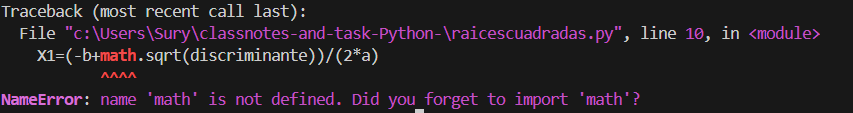

# classnotes-and-task-Python-

***¿Para qué sirve la instrucción “input”?*** --> para introducir un valor.
***¿Para qué sirve la instrucción “=”?*** --> para declarar que es igual.
***¿Para qué sirve la instrucción “print”?*** --> mostrar un output.
***¿Para qué sirve la instrucción “suma”?*** --> es una variable.
***¿Para qué sirve el operador “+”?*** --> para sumar dos valores o añadir.

***¿Para que el programa funcione es necesario cambiar el nombre de la variable “suma” en la instrucción suma=x*y?*** -->
No, las variables simplemente almacenan información, no importa el nombre.

***¿Crees que sería más lógico que esta variable tuviera otro nombre teniendo en cuenta que la instrucción sirve para multiplicar?*** -->

Si, haría el código más legible y limpio.

***¿Qué ocurre si modificas la instrucción suma=x*y y escribes x*y ?*** -->

Que cuando intentes imprimir suma, va a dar error porque no existe la variable.

***¿Para qué dirías que sirven las variables en un programa?***

Almacenar información.

***¿Funciona dividiendo cualquier par de números? Prueba a dividir 5/2***

Da error porque no son números enteros.

***¿Qué diferencia debería haber en el resultado cuando divides 4/2 y cuando divides
5/2?¿qué tipos de números conoces? Los has estudiado en Matemáticas.***

Que el resultado es entero o decimal.

***float*** --> Números flotantes (decimales)

***¿Para qué sirve la instrucción “IF”?***
La instrucción IF se utiliza para evaluar una condición. Si la condición es verdadera, se ejecuta el bloque de código que sigue. Esto permite que el programa tome decisiones y ejecute diferentes acciones según el resultado de la evaluación.

***¿Para qué sirve la instrucción “ELSE”?***
La instrucción ELSE se utiliza para ejecutar un bloque de código alternativo cuando la condición evaluada en el IF resulta ser falsa. Es decir, si la condición no se cumple, se ejecuta lo que esté dentro del ELSE.

***¿Qué ocurre si los dos números que introduces son iguales? ¿Por qué?***
Si ambos números son iguales, la condición if x > y no se cumple (ya que ninguno es mayor que el otro), por lo que se ejecutará el bloque del ELSE.

***Ejemplo de situación en la que sea necesario comparar dos datos:***
Un ejemplo práctico es en un sistema de calificaciones, donde se compara la nota obtenida por un estudiante con una nota de aprobación. Este ejemplo suele salir en muchos cursos de programacion como un ejercicio. 

***¿Qué diferencia hay entre el bloque de instrucciones IF-ELSE del EJERCICIO 4 y el del EJERCICIO 5?***
la principal diferencia es que el ejercicio 4 es menos completo, no incluye la posibilidad de que puedan ser iguales.

***¿Cuál de las dos opciones es mejor?¿Por qué?***
Los bloques if-else del ejercicio 5 son mejores ya que tienen capacidad para otras posibilidades de numeros.

***Escribe # a la izquierda de la instrucción import math***

Me dice que el nombre math de la libreria math no existe y que si se me ha olvidado importar la libreria.

***Escribe # a la izquierda de la instrucción discriminante=b**2 - 4*a*c***
<<<<<<< HEAD
=======

>>>>>>> bc02dcf92eaa151cde8b757f53e91afbfa59765c
No puede hacer el calculo del discriminante, como ha dejado de existir pero sigue incluido en otras lineas de codigo no es capaz de dar un output final.

***Quita str de la última instrucción.***
Al quitar el uso de str() en la instrucción de impresión, intentas unir una cadena con un número sin previa conversion porque Python no permite unir directamente cadenas con números.

***Cambia float por int.***
Cuando cambias float por int en las conversiones de entrada, el programa solo acepta números enteros. Si introduces un número con decimales, no funcionara, produciendo un error.

***Apuntes Array***

Aqui hay una lista de equipos de futbol:

-Arsenal
-Liverpool 
-Barcelona 
-Chelsea
-Juventus

Normalmente, los almacenariamos en diferentes variables:

Equipo 1 = Arsenal
Equipo 2 = Liverpool
Equipo 3 = Barcelona
Equipo 4 = Chelsea
Equipo 5 = Juventus

El problema es que esto no es del todo eficiente, por lo que usamos los array

Los array son estructuras de datos que almacenan una coleccion de elementos del mismo tipo 

Ejemplo:
    declare Equipos: array[0:4] of strings (0,1,2,3,4) son 5 elementos.

Equipos[0] = Arsenal
Equipos[1] = Liverpool
Equipos[2] = Barcelona 
Equipos[3] = Chelsea
Equipos[4] = Juventus

***REGISTRO DE ERRORES**
Debo tener cuidado con completar todos los parentesis.
Debo tener el codigo alineado con las instrucciones, en el caso contrario, da error.

***PERDON POR EL POCO USO DE TILDES, PROGRAMO EN EL TECLADO DE REINO UNIDO PORQUE ME RESULTA MAS FACIL Y AUN MAS CON UNA MANO***

